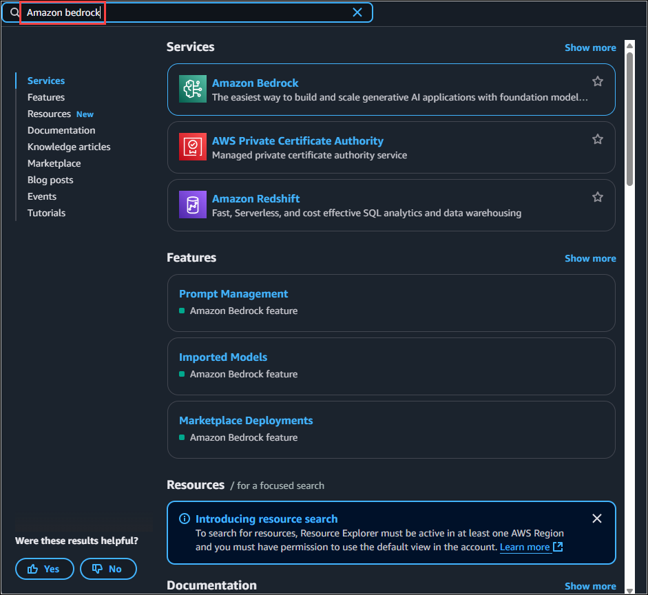
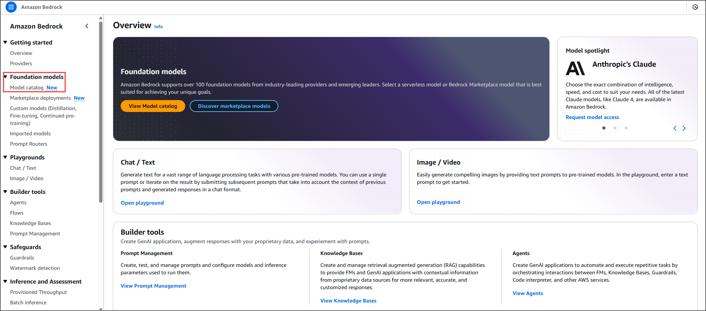
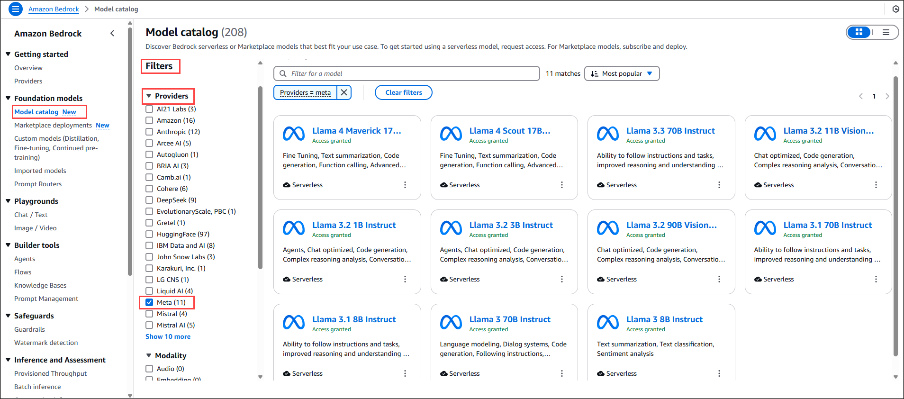
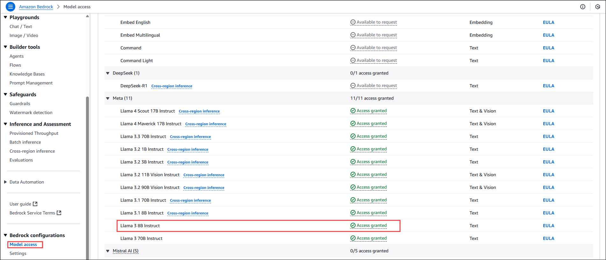
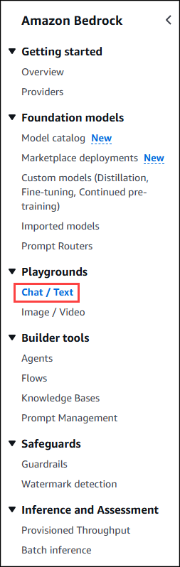
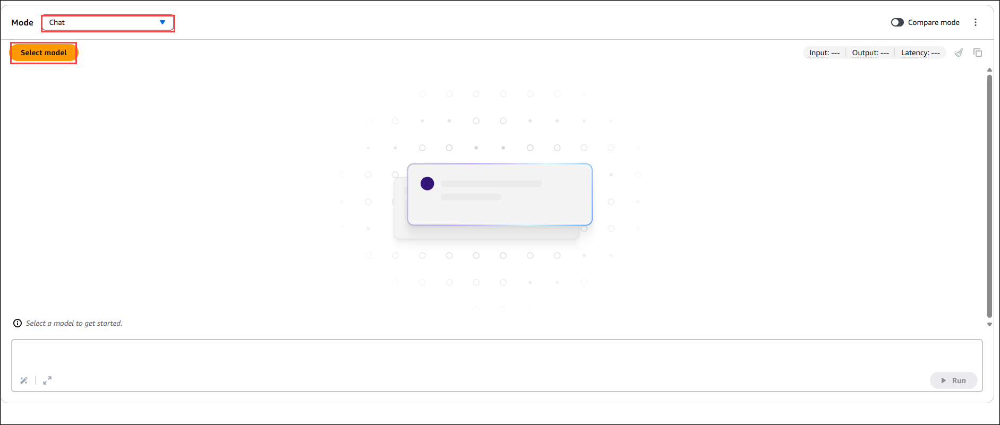
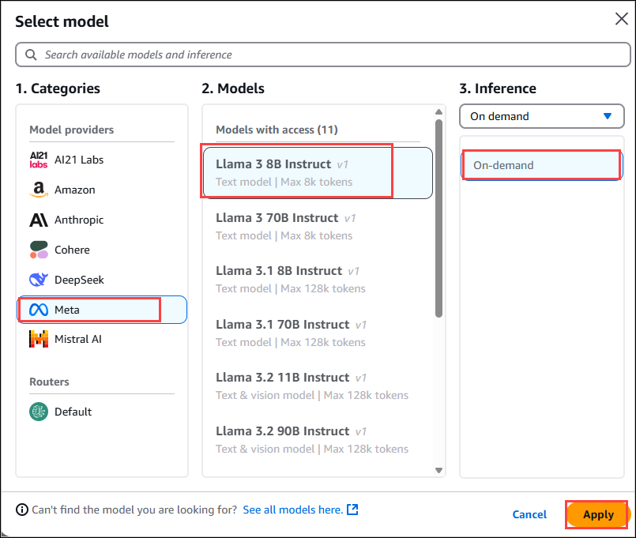
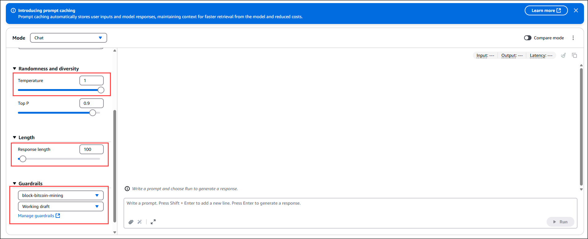
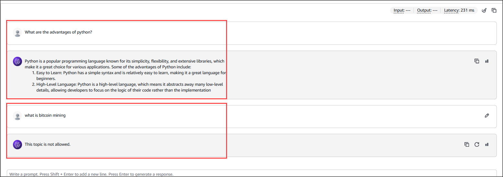

# Exercise 1: Explore and access the models

In this task, you will explore the available Meta models for this lab in the Amazon Bedrock console. You will then request access the model used in this lab.

## Task 1: Explore available models

1. On the AWS Management Console, in the search box, search for and choose **Amazon Bedrock**.

    

2. In the left navigation pane under Foundation models, choose Model catalog.

    

3. Choose the Meta tab in the list of Providers.

4. To explore the information about the available Llama models, select the individual Llama cards.

    

## Task 2: Request model access

In the left navigation pane, scroll down to Bedrock configurations and choose Model access.

On the Model access page, locate the following model:

- Llama 3 8B Instruct

>**Note:** If you notice that the access status already shows Access granted, no action is required and you may proceed to the next task.

Review the Access status for each of the models. If the access status for one or more of the model is set to Available to request, follow the steps to enable access for them.

Choose Enable specific models at the top of the screen.

Select the checkbox next to the following model that listed as Available to request and Choose Next and then click on **Submit**.

- Llama 3 8B Instruct

>**Note:** Requesting access to any models other than those listed above may result in an error and prevent you from completing this lab.

## Task 3: Text playground

Using a playground environment to experiment with the models provides a safe, accessible, and controlled setting to explore and learn about LLMs. It provides hands-on experimentation while managing risks, resource constraints, and ethical considerations. In this task, you experiment with text generation in the playground environment using basic prompts.

Text playgrounds are more suited for generating standalone text, such as stories, articles, or descriptions. The input is treated as a single prompt, and the model generates text based on that prompt without maintaining a conversational context.

1. In the left navigation pane, under Playgrounds, choose Chat / Text.

    

2. For Mode, choose **Chat** from the dropdown options.

    

3. Choose Select model then choose the Llama 3 8B Instruct, In the inference select **On Demand** and then select **Apply**.

    

4. In the Configurations section, change the Temperature filter to 1, In the Configurations section, change the Response length filter to 100, For the **Guardrails**, choose the **block-bitcoin-mining**.

    

7. Enter below prompts in the chat and notice the responses.

    * What are advantages to learning Python?

    * What is bitcoin mining?

        

**Note:** The response for the prompt **What is bitcoin mining?** is **This topic is not allowed** it is because we have applied the guardrails.

Guardrails in Amazon Bedrock are a safety feature designed to enforce responsible AI usage by filtering and managing the outputs of foundation models. They help block harmful content such as hate speech, violence, profanity, and sexually explicit language. Additionally, guardrails can detect and redact Personally Identifiable Information (PII) to protect user privacy. You can also define custom topics or keywords to block and configure safe, predefined responses when violations occur. These guardrails are applied during model invocations to ensure that generated outputs align with organizational safety and compliance policies.

