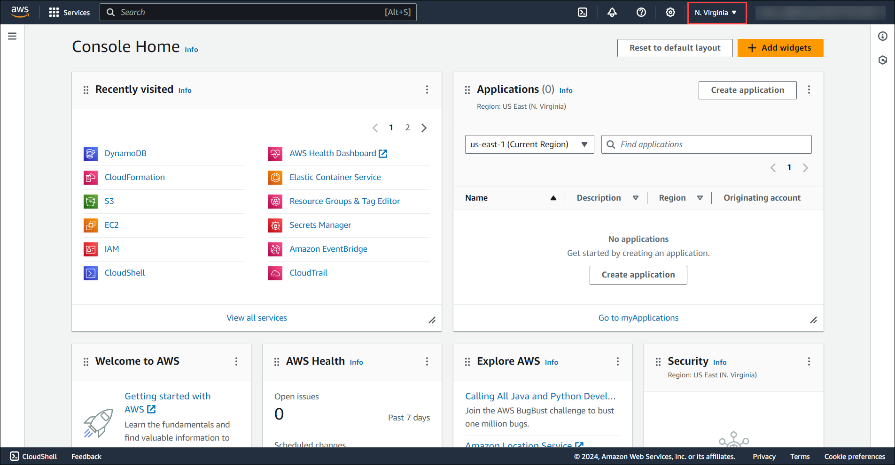

# Getting Started With The Lab
   
Follow the steps below to get started with the lab.

1. Sign in to the AWS Management Console using the credentials provided on the **Environment** tab.

    

    

2. After signing in to the AWS Management Console, choose the region **US-EAST-1 (N. Virginia)** from the drop-down menu.

    
