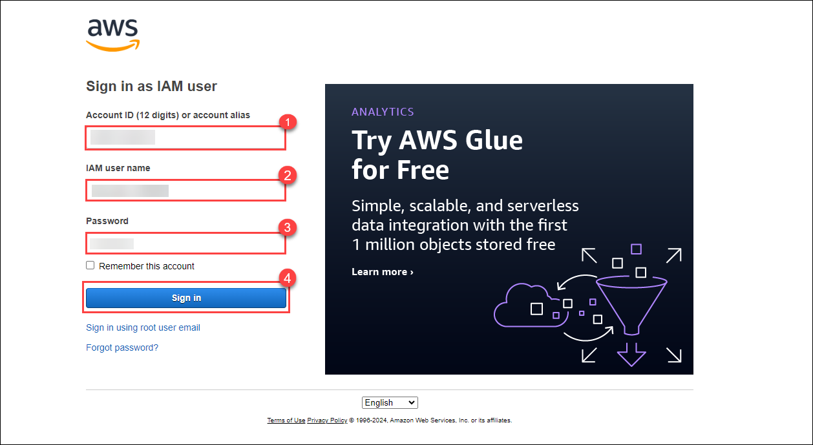

# Getting Started With The Lab
   
Follow the steps below to get started with the lab.

1. Sign in to the AWS Management Console by copying the **Sign-in link, Username, and Password** provided below.

    * **Sign-in Link**: **<inject key="SignInUrl" enableCopy="true" />**

    * **IAM Username**: **<inject key="UserName" enableCopy="true" />**

    * **Password**: **<inject key="Password" enableCopy="true" />**

    

    Alternatively, you can also find these values on the **CloudLabs** Environment tab.

    

2. After signing in to the AWS Management Console, choose the region **US-EAST-1 (N. Virginia)** from the drop-down menu.

    